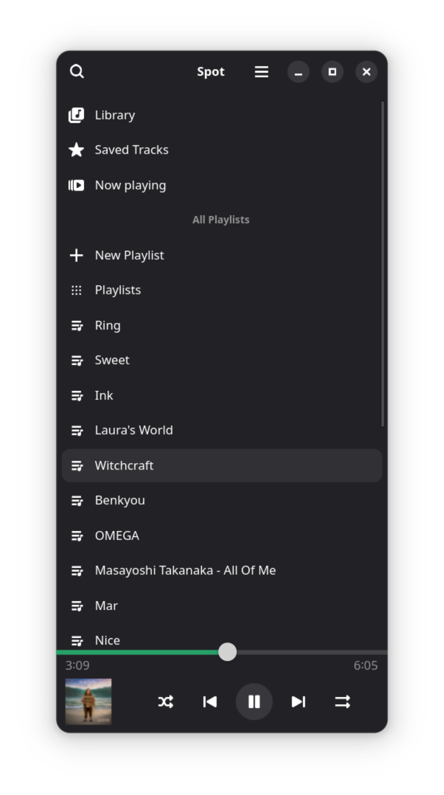

# Spot [](https://github.com/xou816/spot/actions/workflows/spot-snapshots.yml)

Gtk/Rust native Spotify client for the GNOME desktop. **Only works with premium accounts!**

Based on [librespot](https://github.com/librespot-org/librespot/).

Join the discussion on [Matrix](https://matrix.to/#/#spot-devel:matrix.org).



## Installing

<a href='https://flathub.org/apps/details/dev.alextren.Spot'></a>

[](https://repology.org/project/spot-client/versions)

## Usage notes

### Credentials

It is recommended to install a libsecret compliant keyring application, such as [GNOME Keyring](https://wiki.gnome.org/action/show/Projects/GnomeKeyring) (aka seahorse). This will allow saving your password securely between launches.

In GNOME, things should work out of the box. It might be a bit trickier to get it working in other DEs: see this [ArchWiki entry](https://wiki.archlinux.org/index.php/GNOME/Keyring) for detailed explanations on how to automatically start the daemon with your session.

Bear special attention to the fact that to enable automatic login, you might have to use the same password for your user account and for the keyring, and that the keyring might need to be [set as default](https://wiki.archlinux.org/index.php/GNOME/Keyring#Passwords_are_not_remembered).

See [this comment](https://github.com/xou816/spot/issues/92#issuecomment-801852593) for more details!

## Features

**Only works with premium accounts!**

- playback control (play/pause, prev/next, seeking, shuffle, repeat (none, all, song))
- selection mode: easily browse and select mutliple tracks to queue them
- browse your saved albums and playlists
- search albums and artists
- view an artist's releases
- view users' playlists
- view album info
- credentials management with Secret Service
- MPRIS integration
- playlist management (creation and edition)
- liked tracks

## Contributing

Contributions are welcome! If you wish, add yourself to the `AUTHORS` files when submitting your contribution.

For any large feature/change, **please** open an issue first to discuss implementation and design decisions.

### Translating

Translations are managed using `gettext` and are available in the `po/` subdirectory.

**Please use [POEditor](https://poeditor.com/join/project?hash=xfVrpQfRBM) to submit translations.**

If you feel like it, you are welcome to open a PR to be added to the `TRANSLATORS` file!

## Building

### With GNOME Builder and flatpak

Pre-requisite: install the `org.freedesktop.Sdk.Extension.rust-stable` SDK extension with flatpak. Builder might do this for you automatically, but it will install an older version; make sure  the version installed matches the version of the Freedesktop SDK GNOME uses.

Open the project in GNOME Builder and make the `dev.alextren.Spot.development.json` configuration active. Then build :)

### Manually

Requires Rust (stable), **GTK4**, and a couple other things. Also requires **libadwaita** and **blueprint-compiler**: they are not packaged on all distros at the moment, you might have to build them yourself!

With meson:

```
meson target -Dbuildtype=debug -Doffline=false --prefix="$HOME/.local"
ninja install -C target
# to run test/linter/etc
meson test -C target  --verbose
```

This will install a `.desktop` file among other things, and the spot executable will be put in `.local/bin` (you might want to add it to your path).

To build an optimized release build, use `-Dbuildtype=release` instead.

### Regenerating potfiles

When adding new `msgids`, don't forget to regenerate/update the potfiles.

```
ninja spot-pot -C target
ninja spot-update-po -C target
```

### Pulling updated strings from POEditor

We are now using POEditor and the wonderful [`poeditor-sync`](https://github.com/mick88/poeditor-sync) tool.

```
poeditor pull
```

### Regenerating sources for flatpak

Using [flatpak-cargo-generator.py](https://github.com/flatpak/flatpak-builder-tools/tree/master/cargo):

```
ninja cargo-sources.json -C target
```

### Debugging

Set the `RUST_LOG` env variable to the appropriate level.

Debug builds (flatpak) are available from the master branch on Github (see the `spot-snaphots` action).

Spot caches images and HTTP responses in `~/.cache/spot`.

Spot uses [isahc](https://github.com/sagebind/isahc), which uses libcurl, therefore you can set the `https_proxy` env variable to help with debugging. In debug mode, Spot skips SSL certificate verification.
